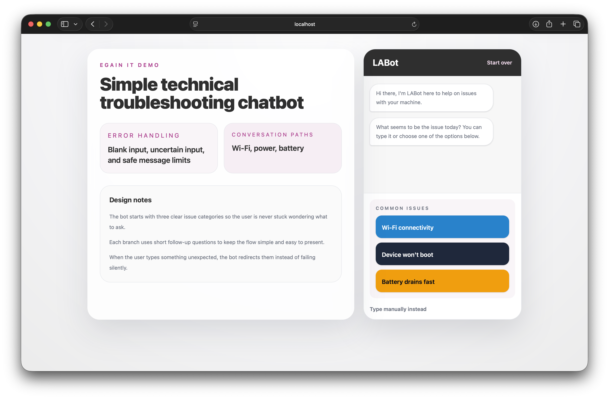
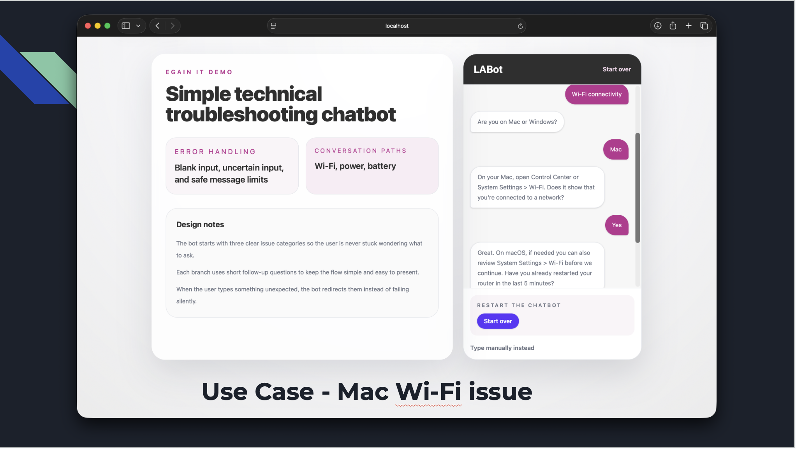
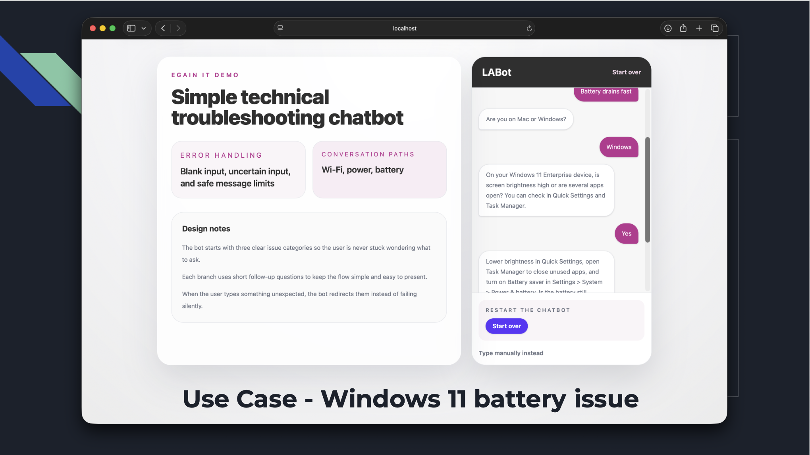
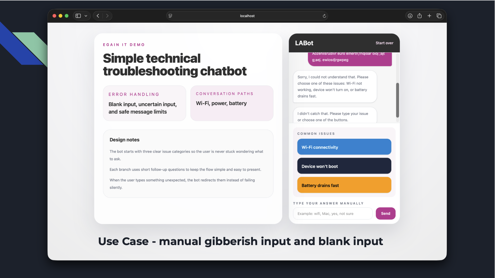
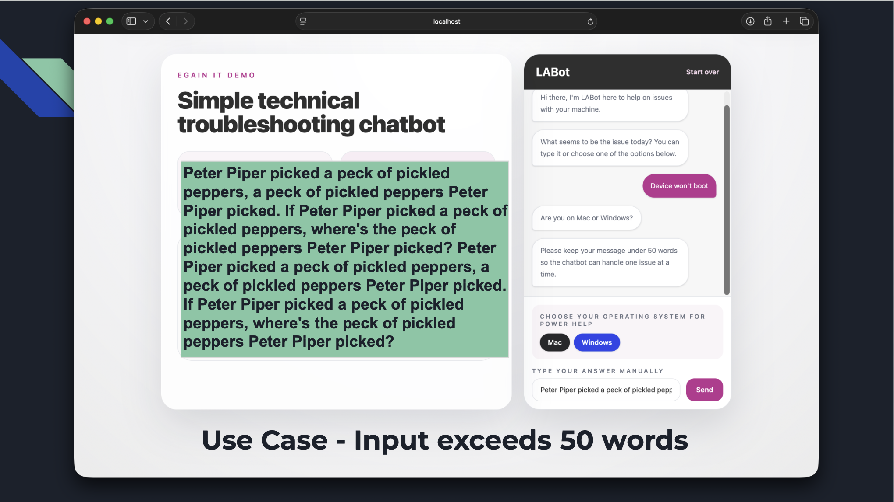

# eGain Technical Troubleshooting Chatbot

This is a simple chatbot prototype built for the eGain take-home assignment.
I chose to focus on guiding a customer through a simple technical troubleshooting process.

The chatbot helps a user with three common problems:

- Wi-Fi not working
- Device won't turn on
- Battery drains fast

It then narrows the conversation by asking whether the user is on `Mac` or `Windows`, and gives simple step-by-step troubleshooting help.

## What This Project Includes

- A working chatbot prototype built with SvelteKit
- A decision-tree style conversation flow
- Preset response buttons to make the chat easier to follow
- Manual input as a backup option
- Error handling for unexpected user input

## Tools Used

- SvelteKit 2.50.2
- Svelte 5.54.0
- Tailwind CSS 4.2.2
- TypeScript 5.9.3
- Vite 7.3.1

## How To Run The Project

If you are new to this, follow these steps in order:

1. Clone the repository to your machine.
2. Open the project folder on your terminal.
3. Install dependencies.
4. Start the development server.
5. Open the local link shown in the terminal.

Use these commands:

```bash
npm install
npm run dev
```

After that, your terminal should show a local address similar to:

```bash
http://localhost:5173
```

Open that link in your browser.

## Useful Commands

```bash
npm run dev
```

Starts the local development server.

```bash
npm run check
```

Checks the project for Svelte and TypeScript errors.

```bash
npm run build
```

Builds the project for production.

```bash
npm run preview
```

Previews the production build locally.

## How The Chatbot Works

The chatbot uses a simple guided flow:

1. The user chooses one of three issue types.
2. The chatbot asks whether the user is on `Mac` or `Windows`.
3. The chatbot asks short follow-up questions.
4. The chatbot gives the user a next troubleshooting step.

The goal is to keep the conversation smooth and easy to follow instead of making it too complex.

## Error Handling

This project includes simple error handling for unexpected input:

- If the user types a blank message, the chatbot asks them to try again.
- If the user types something outside the supported issue categories, the chatbot redirects them to the available options.
- If the chatbot expects `yes` or `no` and gets something else, it asks the user to choose a clearer response.
- If the user types more than 50 words, the chatbot asks for a shorter message.

## Project Structure

Here are the main files:

- [README.md](/Users/luis_angeles/Desktop/chatbot-app/README.md): explains the project and how to run it
- [assignment-notes.md](/Users/luis_angeles/Desktop/chatbot-app/assignment-notes.md): notes for the assignment, slides, and decision tree
- [src/routes/+page.svelte](/Users/luis_angeles/Desktop/chatbot-app/src/routes/+page.svelte): main chatbot page and interface
- [src/lib/chatbot/data.ts](/Users/luis_angeles/Desktop/chatbot-app/src/lib/chatbot/data.ts): chatbot messages and preset button choices
- [src/lib/chatbot/engine.ts](/Users/luis_angeles/Desktop/chatbot-app/src/lib/chatbot/engine.ts): chatbot conversation logic
- [src/lib/chatbot/types.ts](/Users/luis_angeles/Desktop/chatbot-app/src/lib/chatbot/types.ts): shared types
- [src/lib/chatbot/validation.ts](/Users/luis_angeles/Desktop/chatbot-app/src/lib/chatbot/validation.ts): input validation helpers

## Assignment Summary

This project was designed around the eGain assignment requirement:

`Guiding a customer through a simple technical troubleshooting process`

It uses a simple yet clear decision-tree conversation for presentation purposes.

## Screenshots

### Home Screen



### Wi-Fi Troubleshooting Flow



### Battery Troubleshooting Flow



### Error Handling Example 1



### Error Handling Example 2



## Notes For Reviewers

- This project assumes an enterprise environment.
- Windows users are guided as Windows 11 Enterprise users.
- Mac users are guided using current macOS settings and tools.
- The chatbot is intentionally simple so the flow is easy to understand and explain.
